# Overview
A variety of ComfyUI related stuff. You'll need different models and custom nodes for each different workflow.

# Trobleshooting
* When troubleshooting, it's best to do _all_ of these steps until resolution
* These workflows require ComfyUI to run. See https://youtu.be/2r3uM_b3zA8 for an install guide
* Install **ComfyUI Manager** next - https://github.com/ltdrdata/ComfyUI-Manager
* Need a model or checkpoint? See the resources section below!
* These are just workflows - no custom nodes here, so no code to go wrong :) Scroll down to see the table of workflows and their descriptions.
* __Be sure to keep ComfyUI updated regularly__ - including all custom nodes. Old versions may result in errors appearing. This is the most common issue, so update now!
* Use **ComfyUI Manager** to install missing custom nodes by clicking "Install Missing Custom Nodes"
* If ComfyUI Manager can't find a node automatically, use the _search_ feature
* Custom node still red after installing it? Remember to restart ComfyUI!
* Custom node still giving an error? Check the GitHub page for that custom node - maybe someone else has a similar issue open?
* Not sure where the GitHub page is for a custom node? You can click on it via ComfyUI Manager
* By default, models are saved in subdirectories under ``ComfyUI/models``, though some custom nodes have their own models directory.
* Don't mix SDXL and SD1.5 models unless stated (such as SDXL needing the SD 1.5 vision model) - chances are you'll get an error!
* Sometimes custom nodes make breaking changes and the same node may need to be re-created. Typically the custom node GitHub page has such information.
* Sometimes custom nodes just break! Check the github page for the custom node causing any issues for more information and to raise issues
* Sometimes custom nodes change functionality, so check for updates. Changes include:
  * Segement anything - mask output inverted
  * Dynamic Thresholding - output different
  * The original IPAdapter is becoming deprecated
* The Microsoft Windows portable version of ComfyUI apparently has issues with various custom nodes, whereas normal installs are OK. Unknown error? Try a normal install!
* Need more help? See this [Playlist with loads of ComfyUI guides](https://www.youtube.com/playlist?list=PLjC8P1vEncQDahWnl_WKYsjF_tmIDXWEa)

# Resources
Item | Description | Link
| --- | --- | --- | 
ComfyUI | The main thing you'll need! | https://github.com/comfyanonymous/ComfyUI<br>See https://youtu.be/2r3uM_b3zA8 for an install guide
ComfyUI Manager | Install any missing nodes using this | https://github.com/ltdrdata/ComfyUI-Manager
Stability AI | Models & VAEs | https://huggingface.co/stabilityai
Text-to-Image models | Text-2-image models | https://huggingface.co/models?pipeline_tag=text-to-image&sort=trending
SSD-1B | Text2-image model | https://huggingface.co/segmind/SSD-1B
ControlNet Models | ControlNet Models | https://huggingface.co/lllyasviel/sd_control_collection/tree/main<br>https://huggingface.co/comfyanonymous/ControlNet-v1-1_fp16_safetensors/tree/main
QR Code Monster Control Net | ControlNet Model | https://huggingface.co/monster-labs/control_v1p_sd15_qrcode_monster
IP Adpater | Github Repo | https://github.com/tencent-ailab/IP-Adapter
IP Adapter models | Models | https://huggingface.co/h94/IP-Adapter
T2I Adapter | Github Repo | https://github.com/TencentARC/T2I-Adapter
Control LoRA | Control Models | https://huggingface.co/stabilityai/control-lora
AnimateDiff | Original repo, many links and more info | https://github.com/guoyww/AnimateDiff
Latent Consistency Models | Models | https://huggingface.co/latent-consistency
Upscale Wiki | Many models & info | https://upscale.wiki/wiki/Main_Page
Artist Style Studies | SDXL Prompt output examples for inspiration | https://sdxl.parrotzone.art/

# Updating / Installing Custom Nodes
* Use ComfyUI Manager to install and update custom nodes with ease!
* Click "Install Missing Custom Nodes" to install any red nodes
* Use the "search" feature to find any nodes
* __Be sure to keep ComfyUI updated regularly__ - including all custom nodes. Old versions may result in errors appearing.

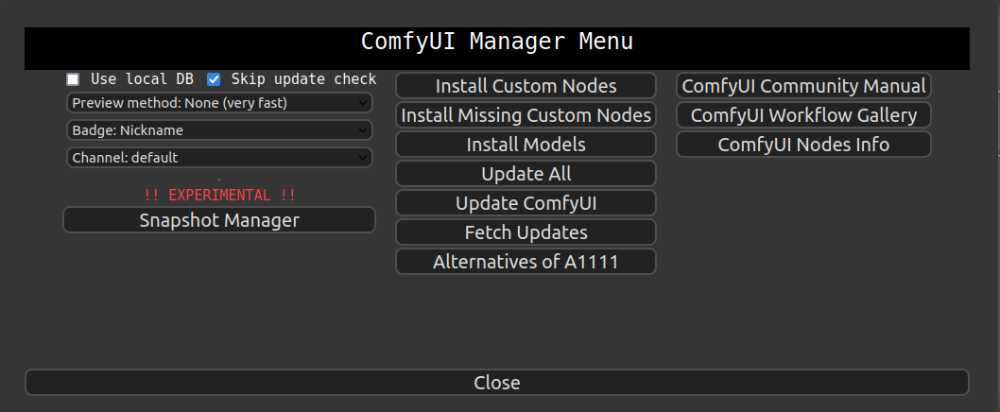</img>

# Workflows available
In ComfyUI the image **IS** the workflow. Simply drag or load a workflow image into ComfyUI!

Workflow | Description | Version
| --- | --- | --- |
</img> | Basic SDXL ControlNet workflow.<br>Introductory SDXL Canny & Depth ControlNet example.<br>See https://youtu.be/reqamcrPYiM for more information. | SDXL
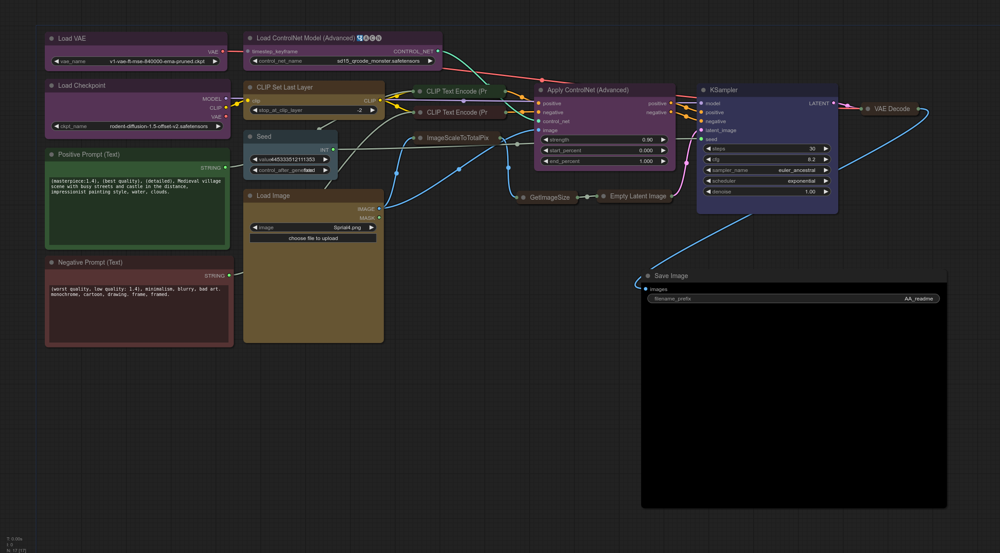</img>| Basic QR Code Monster SD 1.5 ControlNet - make spiral art!<br>See also - https://youtu.be/D4oJz0w36ps | SD 1.5
</img>| QR Code Monster SD 1.5 ControlNet - make animated spiral art!<br>See also: https://youtu.be/D4oJz0w36ps | SD 1.5
</img> | Updated QR Code Monster SD 1.5 ControlNet with AnimateDiff and FreeU<br>Works best with the v1 QR Code Monster - https://huggingface.co/monster-labs/control_v1p_sd15_qrcode_monster | SD 1.5
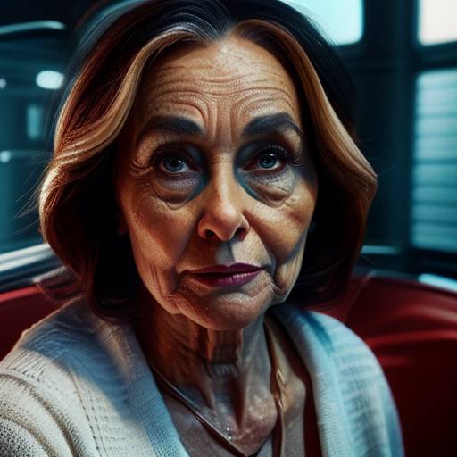</img> | AnimateDiff with Montion LoRA example. Pan up, down, left right, etc. | SD 1.5
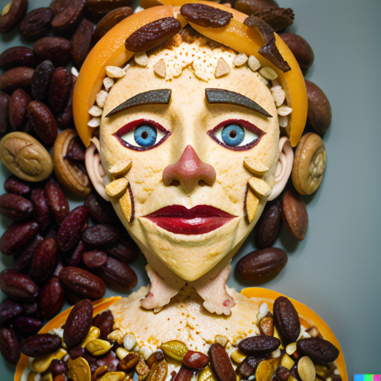</img>|Instant LoRA 1<br>Inspired by <a href="https://civitai.com/articles/2345/aloeveras-instant-lora-no-training-15-sdxl">AloeVera</a> (almost identical).<br>Really simple, no training, "LoRA" like functionality.<br>SD 1.5. IP Adapter models:<br>**1.** https://huggingface.co/h94/IP-Adapter/blob/main/models/ip-adapter-plus_sd15.bin -> ```custom_nodes/IPAdapter-ComfyUI/models```.<br>**2.** https://huggingface.co/h94/IP-Adapter/blob/main/models/image_encoder/model.safetensors -> ```models/clip_vision```.<br>**Video guide** - https://youtu.be/HtmIC6fqsMQ | SD 1.5
</img>|Instant LoRA 2<br>As above, but with ControlNet to guide the shape | SD 1.5
</img>|Instant LoRA 3<br>As above, but with QR Code Monster ControlNet too :) | SD 1.5
</img>|Instant LoRA 4<br>As above, but with basic upscaling | SD 1.5
</img>|Instant LoRA 5<br>As above, but with more upscaling to 16k+ | SD 1.5
</img>|Instant LoRA 6<br>As above, but different upscaling to 16k+ | SD 1.5
</img>|Morphing AI videos of any length using AnimateDiff. SD 1.5. Includes IPAdapter & Upscaling. IP Adapter models:<br>**1.** https://huggingface.co/h94/IP-Adapter/blob/main/models/ip-adapter-plus_sd15.bin -> ```custom_nodes/IPAdapter-ComfyUI/models```.<br>**2.** https://huggingface.co/h94/IP-Adapter/blob/main/models/image_encoder/model.safetensors -> ```models/clip_vision```.<br>**Video guide** - https://youtu.be/6A3a0QNPhIs | SD 1.5
</img>|Morphing AI videos of any length using AnimateDiff. SD 1.5. Includes Upscaling. Like above, but without IPAdapter controls. | SD 1.5
</img>|SDXL "Instant LoRA" - basic.<br>Really simple, no training, "LoRA" like functionality.<br>Uses SDXL IP Adapter - https://huggingface.co/h94/IP-Adapter<br>Video - https://youtu.be/dGL02W4QatI | SDXL
</img>|SDXL "Instant LoRA" - with CLIP Vision<br>Uses SDXL IP Adapter - https://huggingface.co/h94/IP-Adapter<br>Also use "Revisions" CLIP vision - https://huggingface.co/stabilityai/control-lora | SDXL
</img>|SDXL "Instant LoRA" - with CLIP Vision & ControlNet<br>Uses SDXL IP Adapter - https://huggingface.co/h94/IP-Adapter<br>Also use "Revisions" CLIP vision - https://huggingface.co/stabilityai/control-lora | SDXL
</img>|AnimateDiff + QRCode (Vid2Vid)<br>Use any high-contrast input video to create guided animations! Spirals away... | SD 1.5
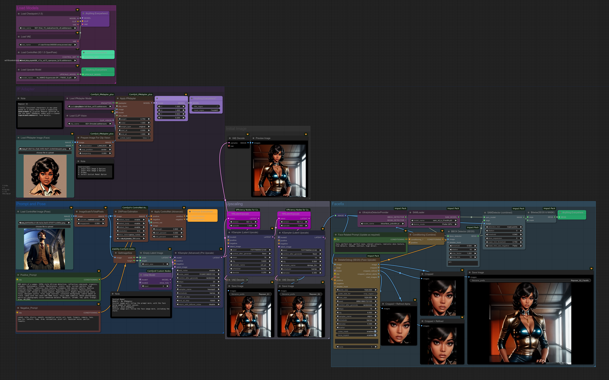</img><br>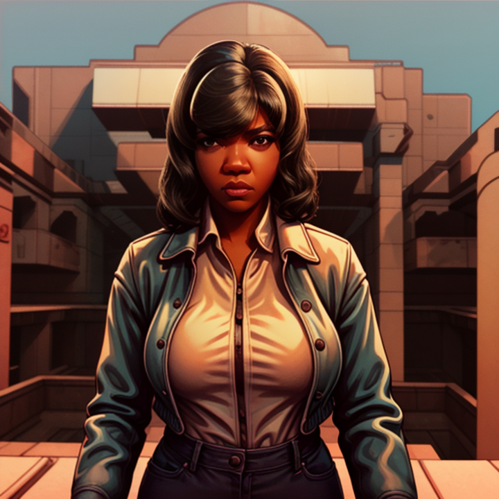</img><br>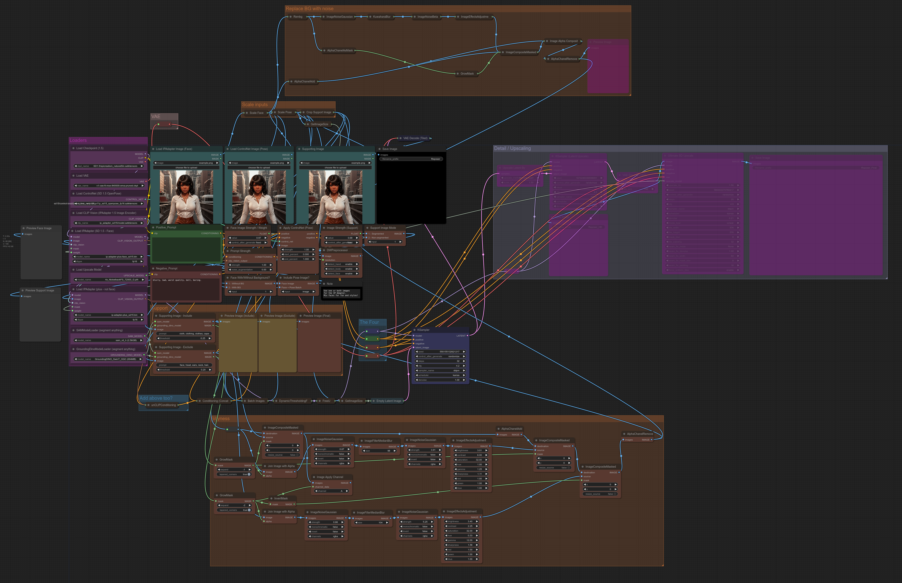</img>|SD 1.5 Reposer (3 versions) - single face image to any pose. Get consistent faces!<br>**No** "roop" or similar face-swapping nodes required = easy install!<br>SD 1.5 ControlNet models:<br>https://huggingface.co/comfyanonymous/ControlNet-v1-1_fp16_safetensors/tree/main<br>IP Adapter models:<br>**1.** https://huggingface.co/h94/IP-Adapter/blob/main/models/ip-adapter-plus-face_sd15.bin -> ```custom_nodes/IPAdapter-ComfyUI/models```.<br>**2.** https://huggingface.co/h94/IP-Adapter/blob/main/models/image_encoder/model.safetensors -> ```models/clip_vision```.<br>IPAdapter Extension - https://github.com/laksjdjf/IPAdapter-ComfyUI<br>Updated due to node changes - now also with fewer noodles!<br>Reposer, Reposer Plus and Reposer Plus BG<br>**Reposer Basic Video guide** - https://youtu.be/SacK9tMVNUA<br>**Reposer Plus Video guide** - https://youtu.be/ZcCfwTkYSz8 | SD 1.5
|SD 1.5 Video Styler! Combining IPAdapter with Video-to-video for strange styles and weird animations<br>Uses https://github.com/cubiq/ComfyUI_IPAdapter_plus<br>The pre-trained models are available on [huggingface](https://huggingface.co/h94/IP-Adapter), download and place them in the ```ComfyUI/custom_nodes/ComfyUI_IPAdapter_plus/models``` directory.<br>For SD1.5 you need:<br>* ip-adapter_sd15.bin<br>* ip-adapter_sd15_light.bin<br>* ip-adapter-plus_sd15.bin<br>* ip-adapter-plus-face_sd15.bin<br>Additionally you need the image encoder to be placed in the ```ComfyUI/models/clip_vision/``` directory.<br>They are the same models used by the _other_ IPAdapter custom nodes ;) - symlinks are your friend! | SD 1.5
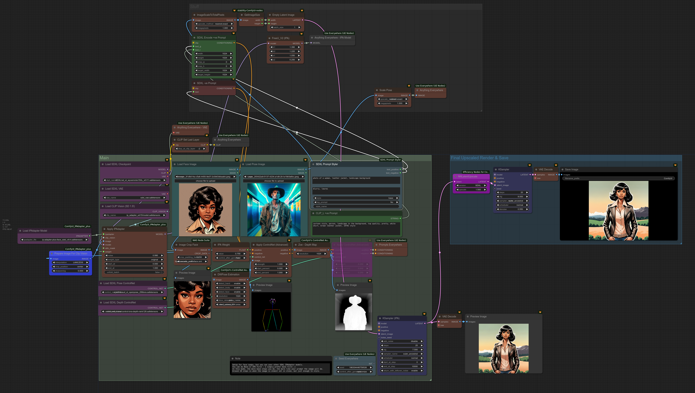|SDXL version of Reposer using the SDXL "IPAdapter Plus Face" model<br>Pick a face then add a body in any pose - no training!<br>Works with photorealistic faces, anime faces, cartoon faces, etc | SDXL
|SSD-1B Workflow - SDXL for 8GB VRAM cards!<br>Model - https://huggingface.co/segmind/SSD-1B<br>Video - https://youtu.be/F-bKndyQ7L8|SSD-1B
|LCM LoRA vs Normal|1.5, SDXL, SSD-1B
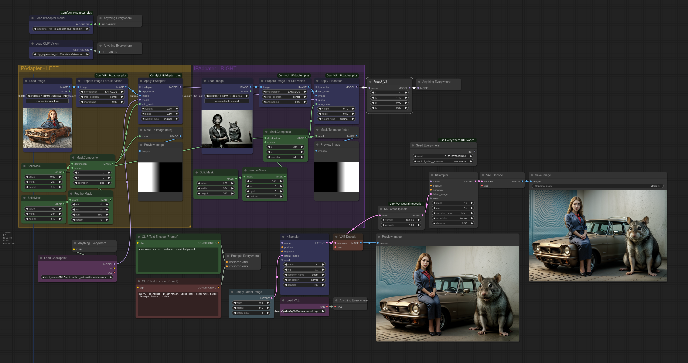|IPAdapter Attention Masking Example<br>**Video** https://youtu.be/riLmjBlywcg|1.5
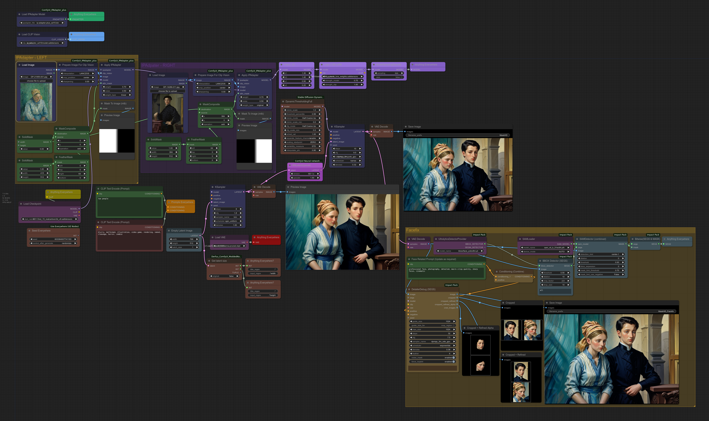|IPAdapter Attention Masking Example with extra toppings (LCM, Facefix)<br>**Video** https://youtu.be/riLmjBlywcg|1.5

# Custom Node List
The current custom node list is shown in the image below. This is a complete list. Not all nodes are used in workflows.<br>
Install custom nodes using ComfyUI manager<br>
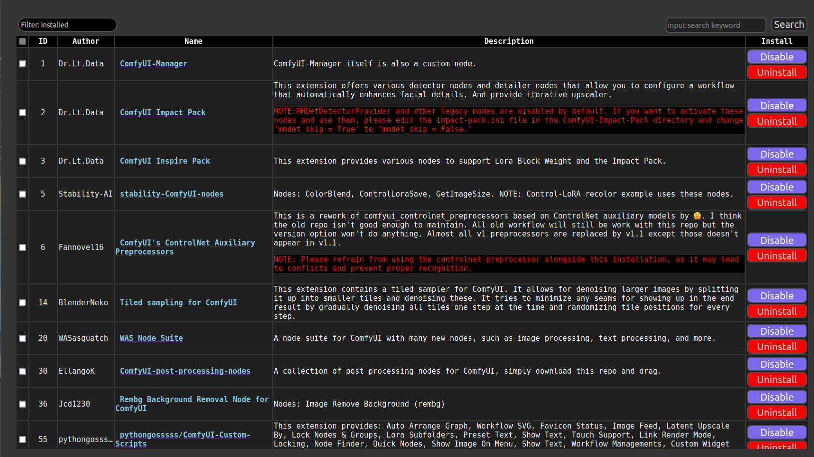<br>
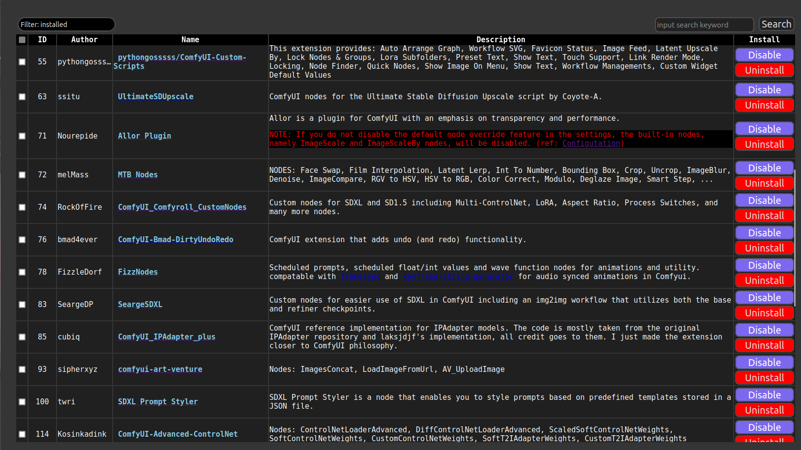<br>
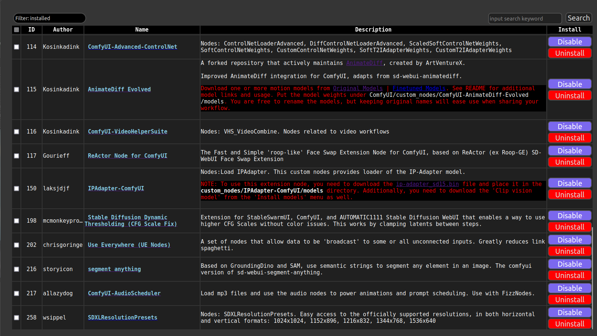<br>
